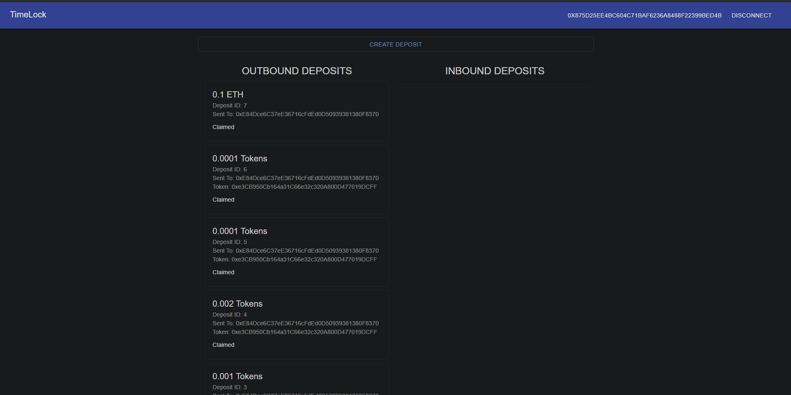
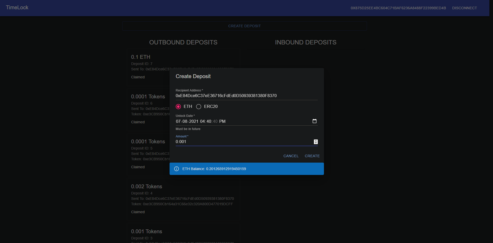
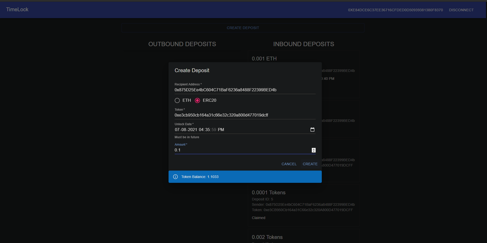

# Ethereum-Timelock
Implementation of a simple time locked deposit mechanism on Ethereum

URL: https://ethereum-timelock.netlify.app

Contract: https://kovan.etherscan.io/address/0xAE7f9CCFa9f483014e1724d784be006B69AB543E

## Features:
1. Deposit ETH or Arbitrary ERC20 tokens redeemable by a specified address once the locking period expires.
2. Meta-Transaction enabled Claim operation using Biconomy.

## Screenshots
### Homepage

### ETH Deposits

### ERC20 Deposits

